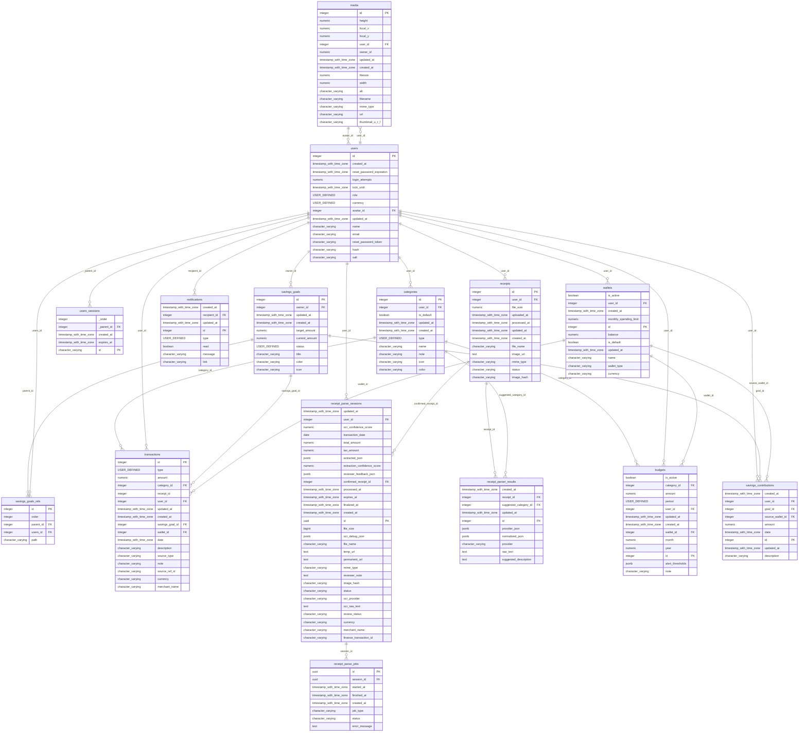

# Database Schema

## Tables and Attributes

### `media`

| Column Name | Data Type | Nullable | Foreign Key |
| ----------- | --------- | -------- | ----------- |
| id | integer | NO |  |
| height | numeric | YES |  |
| focal_x | numeric | YES |  |
| focal_y | numeric | YES |  |
| user_id | integer | YES | -> users.id |
| owner_id | numeric | YES |  |
| updated_at | timestamp with time zone | NO |  |
| created_at | timestamp with time zone | NO |  |
| filesize | numeric | YES |  |
| width | numeric | YES |  |
| alt | character varying | NO |  |
| filename | character varying | YES |  |
| mime_type | character varying | YES |  |
| url | character varying | YES |  |
| thumbnail_u_r_l | character varying | YES |  |

### `categories`

| Column Name | Data Type | Nullable | Foreign Key |
| ----------- | --------- | -------- | ----------- |
| id | integer | NO |  |
| user_id | integer | YES | -> users.id |
| is_default | boolean | YES |  |
| updated_at | timestamp with time zone | NO |  |
| created_at | timestamp with time zone | NO |  |
| type | USER-DEFINED | NO |  |
| name | character varying | NO |  |
| note | character varying | YES |  |
| icon | character varying | YES |  |
| color | character varying | YES |  |

### `users`

| Column Name | Data Type | Nullable | Foreign Key |
| ----------- | --------- | -------- | ----------- |
| id | integer | NO |  |
| created_at | timestamp with time zone | NO |  |
| reset_password_expiration | timestamp with time zone | YES |  |
| login_attempts | numeric | YES |  |
| lock_until | timestamp with time zone | YES |  |
| role | USER-DEFINED | NO |  |
| currency | USER-DEFINED | YES |  |
| avatar_id | integer | YES | -> media.id |
| updated_at | timestamp with time zone | NO |  |
| name | character varying | YES |  |
| email | character varying | NO |  |
| reset_password_token | character varying | YES |  |
| hash | character varying | YES |  |
| salt | character varying | YES |  |

### `users_sessions`

| Column Name | Data Type | Nullable | Foreign Key |
| ----------- | --------- | -------- | ----------- |
| _order | integer | NO |  |
| _parent_id | integer | NO | -> users.id |
| created_at | timestamp with time zone | YES |  |
| expires_at | timestamp with time zone | NO |  |
| id | character varying | NO |  |

### `savings_goals`

| Column Name | Data Type | Nullable | Foreign Key |
| ----------- | --------- | -------- | ----------- |
| id | integer | NO |  |
| owner_id | integer | YES | -> users.id |
| updated_at | timestamp with time zone | NO |  |
| created_at | timestamp with time zone | NO |  |
| target_amount | numeric | NO |  |
| current_amount | numeric | YES |  |
| status | USER-DEFINED | YES |  |
| title | character varying | NO |  |
| color | character varying | YES |  |
| icon | character varying | YES |  |

### `notifications`

| Column Name | Data Type | Nullable | Foreign Key |
| ----------- | --------- | -------- | ----------- |
| created_at | timestamp with time zone | NO |  |
| recipient_id | integer | NO | -> users.id |
| updated_at | timestamp with time zone | NO |  |
| id | integer | NO |  |
| type | USER-DEFINED | NO |  |
| read | boolean | YES |  |
| message | character varying | NO |  |
| link | character varying | YES |  |

### `savings_goals_rels`

| Column Name | Data Type | Nullable | Foreign Key |
| ----------- | --------- | -------- | ----------- |
| id | integer | NO |  |
| order | integer | YES |  |
| parent_id | integer | NO | -> savings_goals.id |
| users_id | integer | YES | -> users.id |
| path | character varying | NO |  |

### `transactions`

| Column Name | Data Type | Nullable | Foreign Key |
| ----------- | --------- | -------- | ----------- |
| id | integer | NO |  |
| type | USER-DEFINED | NO |  |
| amount | numeric | NO |  |
| category_id | integer | NO | -> categories.id |
| receipt_id | integer | YES |  |
| user_id | integer | NO | -> users.id |
| updated_at | timestamp with time zone | NO |  |
| created_at | timestamp with time zone | NO |  |
| savings_goal_id | integer | YES | -> savings_goals.id |
| wallet_id | integer | YES | -> wallets.id |
| date | timestamp with time zone | NO |  |
| description | character varying | YES |  |
| source_type | character varying | YES |  |
| note | character varying | YES |  |
| source_ref_id | character varying | YES |  |
| currency | character varying | YES |  |
| merchant_name | character varying | YES |  |

### `receipt_parse_sessions`

| Column Name | Data Type | Nullable | Foreign Key |
| ----------- | --------- | -------- | ----------- |
| updated_at | timestamp with time zone | NO |  |
| user_id | integer | NO | -> users.id |
| ocr_confidence_score | numeric | YES |  |
| transaction_date | date | YES |  |
| total_amount | numeric | YES |  |
| tax_amount | numeric | YES |  |
| extracted_json | jsonb | YES |  |
| extraction_confidence_score | numeric | YES |  |
| reviewer_feedback_json | jsonb | YES |  |
| confirmed_receipt_id | integer | YES | -> receipts.id |
| processed_at | timestamp with time zone | YES |  |
| expires_at | timestamp with time zone | NO |  |
| finalized_at | timestamp with time zone | YES |  |
| created_at | timestamp with time zone | NO |  |
| id | uuid | NO |  |
| file_size | bigint | YES |  |
| ocr_debug_json | jsonb | YES |  |
| file_name | character varying | NO |  |
| temp_url | text | NO |  |
| permanent_url | text | YES |  |
| mime_type | character varying | YES |  |
| reviewer_note | text | YES |  |
| image_hash | character varying | YES |  |
| status | character varying | NO |  |
| ocr_provider | character varying | YES |  |
| ocr_raw_text | text | YES |  |
| review_status | character varying | NO |  |
| currency | character varying | YES |  |
| merchant_name | character varying | YES |  |
| finance_transaction_id | character varying | YES |  |

### `wallets`

| Column Name | Data Type | Nullable | Foreign Key |
| ----------- | --------- | -------- | ----------- |
| is_active | boolean | NO |  |
| user_id | integer | NO | -> users.id |
| created_at | timestamp with time zone | NO |  |
| monthly_spending_limit | numeric | YES |  |
| id | integer | NO |  |
| balance | numeric | NO |  |
| is_default | boolean | NO |  |
| updated_at | timestamp with time zone | NO |  |
| name | character varying | NO |  |
| wallet_type | character varying | NO |  |
| currency | character varying | NO |  |

### `receipts`

| Column Name | Data Type | Nullable | Foreign Key |
| ----------- | --------- | -------- | ----------- |
| id | integer | NO |  |
| user_id | integer | NO | -> users.id |
| file_size | numeric | YES |  |
| uploaded_at | timestamp with time zone | NO |  |
| processed_at | timestamp with time zone | YES |  |
| updated_at | timestamp with time zone | NO |  |
| created_at | timestamp with time zone | NO |  |
| file_name | character varying | NO |  |
| image_url | text | NO |  |
| mime_type | character varying | YES |  |
| status | character varying | NO |  |
| image_hash | character varying | YES |  |

### `receipt_parser_results`

| Column Name | Data Type | Nullable | Foreign Key |
| ----------- | --------- | -------- | ----------- |
| created_at | timestamp with time zone | NO |  |
| receipt_id | integer | NO | -> receipts.id |
| suggested_category_id | integer | YES | -> categories.id |
| updated_at | timestamp with time zone | NO |  |
| id | integer | NO |  |
| provider_json | jsonb | YES |  |
| normalized_json | jsonb | YES |  |
| provider | character varying | NO |  |
| raw_text | text | YES |  |
| suggested_description | text | YES |  |

### `budgets`

| Column Name | Data Type | Nullable | Foreign Key |
| ----------- | --------- | -------- | ----------- |
| is_active | boolean | NO |  |
| category_id | integer | NO | -> categories.id |
| amount | numeric | NO |  |
| period | USER-DEFINED | NO |  |
| user_id | integer | NO | -> users.id |
| updated_at | timestamp with time zone | NO |  |
| created_at | timestamp with time zone | NO |  |
| wallet_id | integer | YES | -> wallets.id |
| month | numeric | YES |  |
| year | numeric | YES |  |
| id | integer | NO |  |
| alert_thresholds | jsonb | YES |  |
| note | character varying | YES |  |

### `receipt_parse_jobs`

| Column Name | Data Type | Nullable | Foreign Key |
| ----------- | --------- | -------- | ----------- |
| id | uuid | NO |  |
| session_id | uuid | NO | -> receipt_parse_sessions.id |
| started_at | timestamp with time zone | YES |  |
| finished_at | timestamp with time zone | YES |  |
| created_at | timestamp with time zone | NO |  |
| job_type | character varying | NO |  |
| status | character varying | NO |  |
| error_message | text | YES |  |

### `savings_contributions`

| Column Name | Data Type | Nullable | Foreign Key |
| ----------- | --------- | -------- | ----------- |
| created_at | timestamp with time zone | NO |  |
| user_id | integer | NO | -> users.id |
| goal_id | integer | NO | -> savings_goals.id |
| source_wallet_id | integer | NO | -> wallets.id |
| amount | numeric | NO |  |
| date | timestamp with time zone | NO |  |
| id | integer | NO |  |
| updated_at | timestamp with time zone | NO |  |
| description | character varying | YES |  |

## Entity-Relationship Diagram

