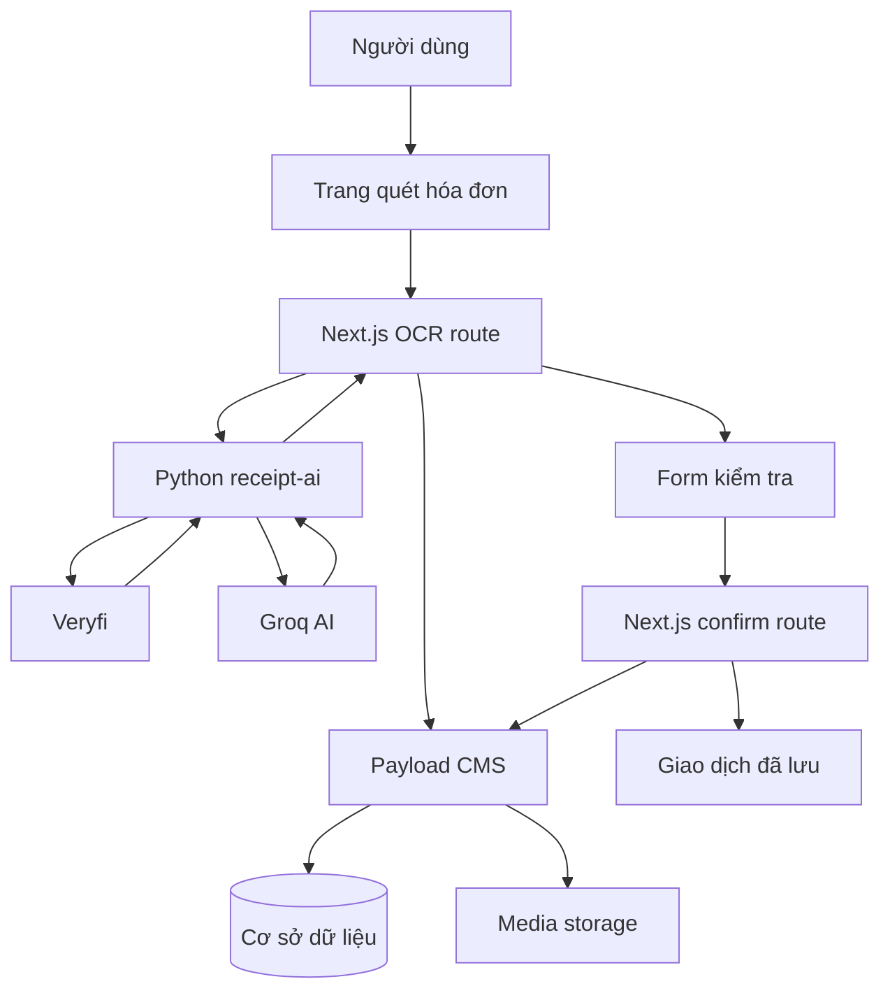

# Workflow OCR hóa đơn

## Mục tiêu

Chức năng OCR hóa đơn giúp người dùng chuyển ảnh hóa đơn thành một giao dịch chi tiêu có cấu trúc. Hệ thống không tự lưu ngay kết quả OCR, mà tạo một màn hình kiểm tra để người dùng chỉnh sửa các trường quan trọng trước khi xác nhận lưu vào Payload.

Mục tiêu chính:

- Trích xuất thông tin hóa đơn từ ảnh: cửa hàng, ngày giao dịch, tổng tiền, đơn vị tiền tệ và danh sách dòng hàng nếu có.
- Gợi ý danh mục chi tiêu dựa trên danh mục hợp lệ của người dùng.
- Tạo mô tả giao dịch mặc định từ nội dung hóa đơn.
- Cho phép người dùng kiểm tra, chỉnh sửa và xác nhận trước khi tạo giao dịch.
- Chỉ lưu ảnh hóa đơn vào `media` sau khi người dùng xác nhận, tránh tạo file rác khi người dùng bỏ dở.

## Đầu vào và đầu ra

### Đầu vào

| STT | Dữ liệu đầu vào                | Nguồn cung cấp                                    | Mô tả                                                                                                             |
| --- | ----------------------------------- | --------------------------------------------------- | ------------------------------------------------------------------------------------------------------------------- |
| 1   | Ảnh hóa đơn                     | Người dùng tải lên tại trang quét hóa đơn | Là ảnh chụp hoặc ảnh tải lên của hóa đơn cần trích xuất thông tin.                                   |
| 2   | Thông tin người dùng            | Hệ thống xác thực                               | Dùng để xác định người đang thao tác và chỉ xử lý dữ liệu trong phạm vi tài khoản đó.          |
| 3   | Danh sách danh mục chi tiêu      | Cơ sở dữ liệu Payload                           | Gồm các danh mục mặc định và danh mục riêng của người dùng, dùng để gợi ý phân loại giao dịch. |
| 4   | Đơn vị tiền tệ ưu tiên       | Hồ sơ người dùng                               | Dùng làm giá trị mặc định khi hóa đơn không nhận diện rõ đơn vị tiền tệ.                         |
| 5   | Thông tin đã chỉnh sửa sau OCR | Người dùng xác nhận trên giao diện           | Gồm tên cửa hàng, ngày, số tiền, danh mục, mô tả và ghi chú trước khi lưu giao dịch.                |

### Đầu ra

#### Kết quả hiển thị sau khi OCR

| STT | Dữ liệu hiển thị                    | Mô tả                                                                                                              |
| --- | --------------------------------------- | -------------------------------------------------------------------------------------------------------------------- |
| 1   | Thông tin hóa đơn đã trích xuất | Bao gồm tên cửa hàng, ngày giao dịch, tổng tiền và đơn vị tiền tệ.                                     |
| 2   | Danh sách mặt hàng                   | Bao gồm tên sản phẩm, số lượng, đơn giá và thành tiền nếu hệ thống nhận diện được.              |
| 3   | Danh mục chi tiêu gợi ý             | Hệ thống đề xuất danh mục phù hợp dựa trên nội dung hóa đơn và danh mục sẵn có của người dùng. |
| 4   | Mô tả giao dịch tự động           | Câu mô tả ngắn được tạo từ tên cửa hàng, ngày, số tiền và danh mục.                                 |
| 5   | Biểu mẫu kiểm tra thông tin         | Giao diện cho phép người dùng xem lại và chỉnh sửa kết quả OCR trước khi lưu.                          |
| 6   | Thông báo kết quả OCR               | Cho biết quá trình quét hóa đơn thành công hoặc trả về lỗi nếu không xử lý được ảnh.            |

#### Dữ liệu được lưu vào cơ sở dữ liệu

| STT | Dữ liệu được lưu | Mô tả                                                                              |
| --- | ---------------------- | ------------------------------------------------------------------------------------ |
| 1   | Giao dịch chi tiêu   | Giao dịch mới được tạo với loại giao dịch là chi tiêu.                    |
| 2   | Số tiền giao dịch   | Tổng tiền sau khi người dùng kiểm tra và xác nhận.                          |
| 3   | Ngày giao dịch       | Ngày phát sinh giao dịch được lấy từ OCR hoặc do người dùng chỉnh sửa. |
| 4   | Danh mục chi tiêu    | Danh mục cuối cùng được người dùng xác nhận trước khi lưu.             |
| 5   | Tên cửa hàng        | Tên đơn vị bán hàng hoặc cửa hàng trên hóa đơn.                         |
| 6   | Đơn vị tiền tệ    | Đơn vị tiền được lưu cùng giao dịch, ví dụ `VND`.                      |
| 7   | Mô tả và ghi chú   | Mô tả tự động và ghi chú bổ sung của người dùng.                         |
| 8   | Ảnh hóa đơn        | Ảnh hóa đơn được lưu vào kho media và liên kết với giao dịch.          |
| 9   | Nguồn tạo giao dịch | Đánh dấu giao dịch được tạo từ chức năng quét hóa đơn AI.             |

## Cách tiếp cận

Với chức năng OCR hóa đơn, hệ thống không chỉ cần đọc chữ từ ảnh mà còn phải chuyển kết quả đó thành một giao dịch chi tiêu có thể sử dụng trong ứng dụng quản lý tài chính. Vì vậy, cách tiếp cận được xây dựng dựa trên ba vấn đề chính: bài toán cần giải quyết, hướng xử lý và lý do lựa chọn hướng xử lý đó.

### Bài toán cần giải quyết

Người dùng thường không muốn nhập hóa đơn thủ công vì quá trình này mất thời gian và dễ sai sót, đặc biệt khi phải nhập lại các thông tin như tên cửa hàng, ngày giao dịch, số tiền và danh mục chi tiêu.

Do đó, hệ thống cần hỗ trợ người dùng tự động đọc ảnh hóa đơn, trích xuất các thông tin quan trọng và chuyển chúng thành dữ liệu giao dịch. Tuy nhiên, kết quả OCR không nên được lưu trực tiếp, vì hóa đơn có thể bị mờ, thiếu thông tin hoặc nhận diện sai. Người dùng vẫn cần có bước kiểm tra và chỉnh sửa trước khi lưu vào cơ sở dữ liệu.

### Hướng giải quyết của hệ thống

Hệ thống sử dụng cách tiếp cận kết hợp giữa OCR, AI và xác nhận của người dùng:

- Veryfi được dùng để đọc ảnh hóa đơn và trích xuất dữ liệu có cấu trúc như tên cửa hàng, ngày giao dịch, tổng tiền, đơn vị tiền tệ và danh sách mặt hàng.
- Groq AI được dùng để phân tích nội dung hóa đơn đã trích xuất, từ đó gợi ý danh mục chi tiêu phù hợp và hỗ trợ tạo mô tả giao dịch.
- Giao diện review cho phép người dùng kiểm tra, chỉnh sửa và xác nhận thông tin trước khi hệ thống tạo giao dịch thật.

Trong kiến trúc triển khai:

- Next.js là lớp giao diện và API trung gian. Thành phần này nhận ảnh hóa đơn từ UI, gọi service OCR, trả kết quả về màn hình kiểm tra, sau đó nhận dữ liệu người dùng đã xác nhận để gửi sang lớp lưu trữ.
- Payload CMS là lớp quản lý dữ liệu và quyền truy cập. Thành phần này xác thực người dùng, truy vấn danh mục hợp lệ, lưu ảnh hóa đơn vào `media` và tạo giao dịch trong `transactions`.
- Python `receipt-ai` chịu trách nhiệm xử lý AI: gọi Veryfi để đọc hóa đơn, chuẩn hóa kết quả và gọi Groq để gợi ý danh mục.

Nói cách khác, Next.js điều phối luồng xử lý giữa giao diện, AI service và backend; còn Payload là nơi quản lý dữ liệu chính của hệ thống, gồm người dùng, danh mục, media và giao dịch.

### Lý do chọn hướng này

OCR có thể đọc dữ liệu từ ảnh, nhưng chỉ đọc được nội dung nhìn thấy trên hóa đơn. Riêng OCR chưa đủ để hiểu ngữ cảnh chi tiêu, ví dụ một hóa đơn từ siêu thị có thể thuộc nhóm ăn uống, mua sắm hoặc sinh hoạt tùy nội dung. Vì vậy, hệ thống cần thêm AI để phân tích ý nghĩa dữ liệu đã trích xuất và gợi ý danh mục phù hợp hơn.

Veryfi được chọn cho bước OCR vì dịch vụ này chuyên xử lý hóa đơn và có thể trả về dữ liệu có cấu trúc, giúp giảm khối lượng xử lý thủ công bằng regex. Groq được dùng cho bước hiểu nội dung và chọn danh mục vì mô hình ngôn ngữ phù hợp với tác vụ phân loại dựa trên ngữ cảnh.

Tuy nhiên, cả OCR và AI đều có khả năng sai. Vì vậy, hệ thống không tự động lưu kết quả ngay sau khi quét, mà dùng luồng review-confirm. Người dùng có quyền kiểm tra và chỉnh sửa thông tin trước khi lưu, giúp giảm rủi ro tạo giao dịch sai trong cơ sở dữ liệu.

Ngoài ra, việc tách AI service khỏi Payload giúp hệ thống rõ trách nhiệm hơn. AI service chỉ xử lý nhận diện và gợi ý, còn Payload vẫn là nơi quản lý dữ liệu chính, quyền truy cập và thao tác lưu giao dịch.

Các thành phần phối hợp như sau:

1. Frontend `/scan` gửi ảnh hóa đơn tới `POST /api/ai/ocr/receipt`.
2. Route Next.js xác thực người dùng, lấy danh mục mặc định và danh mục riêng của người dùng, chỉ giữ các danh mục `expense`.
3. Route Next.js gửi ảnh và metadata sang Python service tại `POST /api/ocr/receipt`.
4. Python service gọi Veryfi, chuẩn hóa dữ liệu, gọi Groq để gợi ý danh mục và trả về dữ liệu review.
5. Frontend hiển thị ảnh hóa đơn và form review.
6. Người dùng chỉnh sửa trường cần thiết rồi xác nhận.
7. Frontend gửi ảnh gốc và payload đã review tới `POST /api/ai/ocr/receipt/confirm`.
8. Confirm route kiểm tra quyền, kiểm tra dữ liệu, upload ảnh vào `media`, tạo giao dịch `transactions`, rồi trả kết quả.

## Mô hình sử dụng trong hệ thống

| Thành phần           | Vai trò trong hệ thống                                                                                                   |
| ---------------------- | --------------------------------------------------------------------------------------------------------------------------- |
| Veryfi                 | Dịch vụ OCR dùng để đọc ảnh hóa đơn và trích xuất dữ liệu có cấu trúc.                                   |
| Groq AI                | Mô hình AI dùng để phân tích nội dung hóa đơn, gợi ý danh mục chi tiêu và hỗ trợ tạo mô tả giao dịch. |
| Next.js                | Lớp giao diện và API trung gian, điều phối luồng xử lý giữa người dùng, AI service và backend.                |
| Payload CMS            | Backend quản lý dữ liệu, xác thực người dùng, quản lý danh mục, media và giao dịch.                           |
| Python FastAPI service | Service AI riêng, đóng gói logic OCR, chuẩn hóa dữ liệu hóa đơn và gọi các dịch vụ AI bên ngoài.          |

Biến môi trường chính:

| Biến                                | Mục đích                                                                      |
| ------------------------------------ | -------------------------------------------------------------------------------- |
| `AI_SERVICE_URL`                   | URL service Python OCR, ví dụ `http://receipt-ai:8000` trong Docker Compose. |
| `VERYFI_CLIENT_ID`                 | Client ID của Veryfi.                                                           |
| `VERYFI_CLIENT_SECRET`             | Client secret của Veryfi.                                                       |
| `VERYFI_USERNAME`                  | Username Veryfi.                                                                 |
| `VERYFI_API_KEY`                   | API key Veryfi.                                                                  |
| `VERYFI_TIMEOUT_SECONDS`           | Timeout khi gọi Veryfi, mặc định 30 giây.                                   |
| `VERYFI_MAX_RETRIES`               | Số lần retry Veryfi, mặc định 2.                                            |
| `GROQ_API_KEY`                     | API key Groq.                                                                    |
| `GROQ_MODEL`                       | Model Groq dùng để phân loại danh mục, mặc định `openai/gpt-oss-20b`. |
| `GROQ_TIMEOUT_SECONDS`             | Timeout khi gọi Groq, mặc định 20 giây.                                     |
| `GROQ_CATEGORY_RESOLUTION_ENABLED` | Bật/tắt gợi ý danh mục bằng Groq.                                          |
| `RECEIPT_PREPROCESS_ENABLED`       | Bật/tắt tiền xử lý ảnh. Có thể bỏ qua trong workflow tổng quát.       |

## Pipeline



Chú thích cách hoạt động:

1. Người dùng tải ảnh hóa đơn tại trang quét hóa đơn.
2. Next.js OCR route nhận ảnh, xác thực người dùng và lấy danh mục hợp lệ từ Payload.
3. Ảnh hóa đơn và thông tin cần thiết được gửi sang Python `receipt-ai`.
4. Python service gọi Veryfi để đọc hóa đơn, sau đó gọi Groq AI để gợi ý danh mục và mô tả.
5. Kết quả OCR được trả về form kiểm tra để người dùng xem lại và chỉnh sửa.
6. Khi người dùng xác nhận, Next.js confirm route gửi dữ liệu đã duyệt sang Payload.
7. Payload lưu giao dịch vào cơ sở dữ liệu và lưu ảnh hóa đơn vào media storage.

## Ví dụ minh họa

### Ảnh hóa đơn đầu vào

Người dùng tải lên ảnh hóa đơn FamilyMart:

```text
AI/bill-test/643675b3-e16b-4a49-93ea-39ff9b00b120.jpg
```

### Kết quả parse OCR mẫu

Kết quả dưới đây minh họa dữ liệu hệ thống có thể trích xuất từ hóa đơn trong ảnh.

```json
{
  "success": true,
  "provider": "veryfi",
  "transaction_type": "expense",
  "source_type": "receipt_ai",
  "review_fields": {
    "merchant_name": "FamilyMart",
    "transaction_date": "2026-04-12",
    "total_amount": 63000,
    "total_amount_display": "63.000",
    "currency": "VND",
    "category_id": "1",
    "category_name": "Ăn uống",
    "category_reason": "Hóa đơn từ cửa hàng tiện lợi, gồm các mặt hàng ăn uống",
    "description": "Ngày 12/04/2026 chi tại FamilyMart số tiền 63.000 VND thuộc nhóm Ăn uống",
    "user_note": ""
  },
  "normalized_receipt": {
    "fields": {
      "merchant_name": "FamilyMart",
      "transaction_date": "2026-04-12",
      "transaction_datetime": "2026-04-12T16:39:00",
      "total_amount": 63000,
      "currency": "VND",
      "payment_method": "MOMO"
    },
    "items": [
      {
        "name": "T3.Kem Celano Socola",
        "quantity": 2,
        "unit_price": 25000,
        "line_total": 50000,
        "confidence": 0.8
      },
      {
        "name": "T3.Reecen thanh cua ăn li",
        "quantity": 1,
        "unit_price": 13000,
        "line_total": 13000,
        "confidence": 0.8
      }
    ],
    "receipt_summary": {
      "merchant_name": "FamilyMart",
      "transaction_date": "2026-04-12",
      "transaction_datetime": "2026-04-12T16:39:00",
      "total_amount": 63000,
      "currency": "VND",
      "provider_category": "Convenience Store",
      "line_items": [
        {
          "name": "T3.Kem Celano Socola",
          "quantity": 2,
          "unit_price": 25000,
          "line_total": 50000,
          "confidence": 0.8
        },
        {
          "name": "T3.Reecen thanh cua ăn li",
          "quantity": 1,
          "unit_price": 13000,
          "line_total": 13000,
          "confidence": 0.8
        }
      ]
    }
  },
  "errors": []
}
```

### Payload xác nhận mẫu

```json
{
  "transaction_type": "expense",
  "source_type": "receipt_ai",
  "review_fields": {
    "merchant_name": "FamilyMart",
    "transaction_date": "2026-04-12",
    "total_amount": 63000,
    "currency": "VND",
    "category_id": "1",
    "description": "Ngày 12/04/2026 chi tại FamilyMart số tiền 63.000 VND thuộc nhóm Ăn uống",
    "user_note": "Thanh toán bằng MOMO"
  }
}
```

### Kết quả lưu mẫu

```json
{
  "success": true,
  "message": "Luu giao dich thanh cong",
  "transaction": {
    "id": 25,
    "amount": 63000,
    "type": "expense",
    "category": 1,
    "merchantName": "FamilyMart",
    "currency": "VND",
    "receipt": 40
  }
}
```

## Đánh giá chất lượng

Mục này đánh giá chức năng OCR hóa đơn hoạt động tốt đến mức nào. Việc đánh giá không chỉ dựa trên khả năng đọc chữ từ ảnh, mà còn dựa trên khả năng chuyển kết quả đó thành giao dịch chi tiêu đúng, phản hồi trong thời gian hợp lý và đảm bảo người dùng có thể kiểm tra trước khi lưu.

| Tiêu chí                        | Cách đánh giá                                                                                                                                        |
| --------------------------------- | -------------------------------------------------------------------------------------------------------------------------------------------------------- |
| Độ chính xác OCR              | Kiểm tra Veryfi có đọc đúng các trường quan trọng như tên cửa hàng, ngày giao dịch, tổng tiền và loại tiền hay không.              |
| Độ chính xác danh mục        | Kiểm tra Groq AI có gợi ý đúng danh mục chi tiêu dựa trên nội dung hóa đơn và danh sách category của người dùng hay không.          |
| Tốc độ phản hồi              | Đo thời gian từ lúc người dùng tải ảnh lên đến khi hệ thống trả kết quả OCR về form xác nhận.                                        |
| Tính ổn định                  | Kiểm tra hệ thống có xử lý được các trường hợp OCR thất bại, thiếu API key, provider timeout hoặc ảnh không hợp lệ hay không.      |
| Trải nghiệm người dùng       | Kiểm tra người dùng có thể xem lại, chỉnh sửa và xác nhận dữ liệu trước khi lưu giao dịch hay không.                                  |
| An toàn dữ liệu                | Kiểm tra hệ thống không tạo giao dịch hoặc lưu ảnh hóa đơn vào cơ sở dữ liệu khi người dùng chưa xác nhận.                        |
| Khả năng xử lý ảnh thực tế | Kiểm tra hệ thống với ảnh hóa đơn chụp bằng điện thoại trong nhiều điều kiện như đủ sáng, hơi mờ, nghiêng hoặc hóa đơn dài. |
| Tính nhất quán kết quả       | Kiểm tra cùng một hóa đơn hoặc các hóa đơn tương tự có cho ra kết quả nhận diện và gợi ý danh mục ổn định hay không.          |

Chất lượng của chức năng được đánh giá dựa trên khả năng trích xuất đúng các trường quan trọng của hóa đơn như tên cửa hàng, ngày giao dịch, tổng tiền và đơn vị tiền tệ. Đây là các trường ảnh hưởng trực tiếp đến độ chính xác của giao dịch được tạo sau khi người dùng xác nhận.

Bên cạnh đó, hệ thống cũng đánh giá khả năng gợi ý danh mục chi tiêu của AI. Kết quả gợi ý được xem là tốt khi danh mục được chọn phù hợp với nội dung hóa đơn và nằm trong danh sách category hợp lệ của người dùng.

Tốc độ phản hồi cũng là một tiêu chí quan trọng vì pipeline OCR phụ thuộc vào các API bên ngoài. Thời gian xử lý cần đủ nhanh để người dùng không phải chờ quá lâu khi quét một hóa đơn. Tiêu chí này có thể được đo bằng thời gian từ lúc gửi ảnh lên đến khi màn hình hiển thị kết quả OCR.

Ngoài ra, chức năng cần được kiểm tra với các ảnh hóa đơn thực tế, không chỉ với ảnh rõ nét. Các trường hợp như ảnh hơi mờ, ảnh nghiêng, hóa đơn dài hoặc điều kiện ánh sáng không tốt giúp đánh giá khả năng hoạt động của hệ thống trong tình huống sử dụng thực tế.

Để giảm rủi ro lưu dữ liệu sai, hệ thống không tự động lưu ngay sau khi OCR. Thay vào đó, dữ liệu được hiển thị trên form xác nhận để người dùng kiểm tra và chỉnh sửa trước khi transaction được tạo chính thức. Cách này giúp tăng tính an toàn dữ liệu và cải thiện trải nghiệm người dùng.

## Chi phí và hiệu năng

### Chi phí

    

| Thành phần               | Chi phí phát sinh                                                                                                    |
| -------------------------- | ---------------------------------------------------------------------------------------------------------------------- |
| Veryfi                     | Có thể tính phí theo số lượng request OCR hoặc số lượng hóa đơn được xử lý.                         |
| Groq AI                    | Có thể tính phí theo số lượt gọi model hoặc lượng token sử dụng trong quá trình phân tích hóa đơn. |
| Máy chủ chạy ứng dụng | Cần tài nguyên CPU/RAM để chạy web app Next.js/Payload và service Python `receipt-ai`.                        |
| Cơ sở dữ liệu          | Cần chi phí lưu trữ và truy vấn dữ liệu người dùng, danh mục, giao dịch và metadata liên quan.          |
| Lưu trữ ảnh hóa đơn  | Cần dung lượng lưu ảnh hóa đơn sau khi người dùng xác nhận lưu giao dịch.                               |
| Băng thông mạng         | Phát sinh khi người dùng upload ảnh, hệ thống gọi API Veryfi/Groq và trả kết quả về frontend.             |

Chi phí vận hành sẽ tăng theo số lượng ảnh hóa đơn được người dùng quét. Mỗi lần quét có thể phát sinh một request đến Veryfi để OCR và một request đến Groq để gợi ý danh mục. Nếu số lượng người dùng hoặc số lượng hóa đơn tăng, chi phí API bên ngoài và chi phí hạ tầng cũng tăng tương ứng.

Hệ thống đã giảm chi phí không cần thiết bằng cách chỉ gọi Veryfi và Groq khi người dùng thực sự thực hiện thao tác quét hóa đơn. Ảnh hóa đơn cũng chỉ được lưu vào `media` sau khi người dùng xác nhận, giúp tránh phát sinh dữ liệu lưu trữ cho các lần quét bị bỏ dở. Ngoài ra, hệ thống chỉ gửi danh sách danh mục cần thiết sang Groq thay vì gửi toàn bộ dữ liệu tài chính của người dùng, giúp giảm lượng dữ liệu xử lý và giới hạn chi phí gọi model.

### Hiệu năng

Về hiệu năng, pipeline OCR có nhiều bước xử lý qua mạng nên thời gian phản hồi không chỉ phụ thuộc vào server nội bộ, mà còn phụ thuộc vào tốc độ của các API bên ngoài. Thời gian xử lý được tính từ lúc người dùng tải ảnh lên đến khi hệ thống trả kết quả OCR về form xác nhận.

| Yếu tố           | Ảnh hưởng đến hiệu năng                                                                                                            |
| ------------------ | ----------------------------------------------------------------------------------------------------------------------------------------- |
| Kích thước ảnh | Ảnh càng lớn thì thời gian upload và xử lý càng lâu.                                                                            |
| Chất lượng ảnh | Ảnh mờ, nghiêng hoặc thiếu sáng có thể làm OCR xử lý chậm hơn hoặc cho kết quả kém chính xác.                          |
| Tốc độ Veryfi   | Đây là bước đọc và phân tích hóa đơn, thường ảnh hưởng nhiều đến thời gian phản hồi.                              |
| Tốc độ Groq AI  | Bước gợi ý danh mục và mô tả có thêm độ trễ do phải gọi model AI.                                                          |
| Kết nối mạng    | Vì hệ thống gọi API bên ngoài, kết nối không ổn định có thể làm request chậm hoặc thất bại.                            |
| Tải đồng thời  | Khi nhiều người dùng quét hóa đơn cùng lúc, web server, AI service và API bên ngoài đều phải xử lý nhiều request hơn. |

Trong cấu hình hiện tại, hệ thống chạy một container `web` cho Next.js/Payload và một container `receipt-ai` cho FastAPI. Service `receipt-ai` được khởi chạy bằng `uvicorn` mặc định, chưa cấu hình nhiều worker riêng. Vì vậy, hệ thống phù hợp với nhu cầu xử lý ở mức cá nhân hoặc nhóm nhỏ, nơi mỗi người thường quét từng hóa đơn riêng lẻ.

### Yêu cầu phần cứng

Chức năng OCR trong hệ thống không tự chạy mô hình AI nặng trên máy chủ nội bộ. Veryfi và Groq xử lý phần OCR/AI ở bên ngoài, nên server của hệ thống chủ yếu chịu trách nhiệm nhận ảnh, gọi API, chuẩn hóa dữ liệu, lưu ảnh và lưu giao dịch.

| Thành phần | Yêu cầu tài nguyên                                                                                                                                                                                                                                  |
| ------------ | ------------------------------------------------------------------------------------------------------------------------------------------------------------------------------------------------------------------------------------------------------- |
| CPU          | Không yêu cầu GPU. CPU phổ thông đủ để chạy Next.js/Payload và FastAPI vì tác vụ AI chính được xử lý qua API bên ngoài.                                                                                                           |
| RAM          | Cần đủ để chạy đồng thời web app, Python service và xử lý file ảnh upload. Với môi trường chạy thử, khoảng 2-4 GB RAM có thể đáp ứng nhu cầu cơ bản; môi trường triển khai thực tế nên tăng theo số người dùng. |
| Lưu trữ    | Cần dung lượng cho ảnh hóa đơn đã xác nhận lưu, log hệ thống và dữ liệu ứng dụng.                                                                                                                                                    |
| Mạng        | Cần kết nối ổn định vì pipeline phụ thuộc vào request đến Veryfi và Groq.                                                                                                                                                                  |

### Khả năng xử lý đồng thời

Hiện tại, hệ thống chưa đặt một giới hạn cố định về số request OCR có thể xử lý cùng lúc. Số lượng request đồng thời tối đa phụ thuộc vào các yếu tố sau:

- Số worker/process của web server và FastAPI service.
- CPU/RAM của máy chủ đang chạy container.
- Kích thước ảnh người dùng upload.
- Thời gian phản hồi và giới hạn quota/rate limit của Veryfi và Groq.
- Khả năng xử lý đồng thời của cơ sở dữ liệu và storage.

Với cấu hình hiện tại, mỗi request OCR sẽ phải chờ các bước gọi Veryfi và Groq, nên điểm nghẽn chính thường nằm ở API bên ngoài và thời gian mạng. Hệ thống có thể nhận nhiều request cùng lúc ở mức ứng dụng web, nhưng để xác định con số tối đa cụ thể cần thực hiện load test với dữ liệu thực tế.

Trong phạm vi đồ án, có thể xem hệ thống phù hợp với kịch bản sử dụng cá nhân: người dùng quét từng hóa đơn, chờ kết quả, kiểm tra rồi xác nhận lưu. Nếu triển khai cho nhiều người dùng đồng thời, cần mở rộng bằng cách tăng số worker cho `receipt-ai`, giới hạn kích thước ảnh upload, thêm hàng đợi xử lý OCR và theo dõi rate limit của Veryfi/Groq.

## Hạn chế

Chức năng OCR hóa đơn vẫn tồn tại một số hạn chế do phụ thuộc vào chất lượng ảnh, định dạng hóa đơn và độ chính xác của các dịch vụ AI bên ngoài.

| Hạn chế                                 | Giải thích                                                                                                                                        |
| ----------------------------------------- | --------------------------------------------------------------------------------------------------------------------------------------------------- |
| Ảnh mờ hoặc thiếu sáng               | OCR có thể đọc sai hoặc bỏ sót thông tin quan trọng như tổng tiền, ngày giao dịch hoặc tên cửa hàng.                              |
| Hóa đơn có bố cục không phổ biến | Với các hóa đơn có layout lạ, bị cắt góc hoặc nhiều thông tin phụ, Veryfi có thể trích xuất thiếu dữ liệu.                     |
| AI gợi ý sai danh mục                  | Groq có thể chọn sai category nếu nội dung hóa đơn không rõ ràng hoặc danh sách category của người dùng đặt tên chưa cụ thể. |
| Phụ thuộc API bên ngoài               | Nếu Veryfi hoặc Groq gặp lỗi, timeout hoặc hết quota, chức năng OCR sẽ bị ảnh hưởng.                                                   |
| Cần người dùng xác nhận             | Hệ thống chưa nên tự động lưu 100% kết quả OCR vì vẫn có khả năng nhận diện sai.                                                   |

Thứ nhất, độ chính xác OCR phụ thuộc nhiều vào chất lượng ảnh đầu vào. Nếu ảnh bị mờ, thiếu sáng, nghiêng, hóa đơn bị nhăn hoặc một phần nội dung bị che khuất, hệ thống có thể đọc sai hoặc thiếu dữ liệu.

Thứ hai, với các hóa đơn có bố cục phức tạp hoặc không phổ biến, Veryfi có thể không trích xuất đầy đủ các trường cần thiết. Điều này đặc biệt ảnh hưởng đến các trường quan trọng như tổng tiền, ngày giao dịch và danh sách mặt hàng.

Bên cạnh đó, việc gợi ý danh mục bằng Groq AI cũng có thể sai trong trường hợp nội dung hóa đơn không rõ ràng hoặc danh sách category của người dùng chưa đủ cụ thể. Ngoài ra, hệ thống còn phụ thuộc vào các API bên ngoài, nên nếu Veryfi hoặc Groq gặp lỗi thì chức năng OCR có thể bị ảnh hưởng.

Vì các lý do trên, hệ thống sử dụng cơ chế review-confirm để người dùng xác nhận trước khi lưu giao dịch. Cách này giúp giảm rủi ro dữ liệu sai được ghi trực tiếp vào cơ sở dữ liệu.
